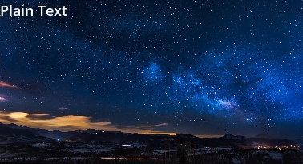
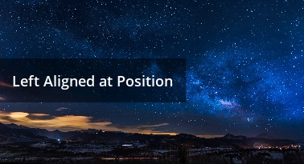
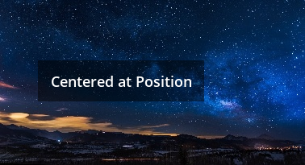
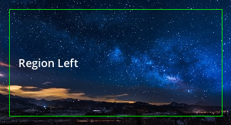
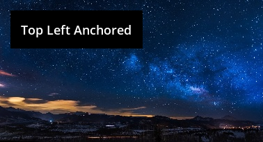
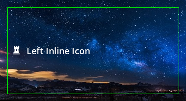
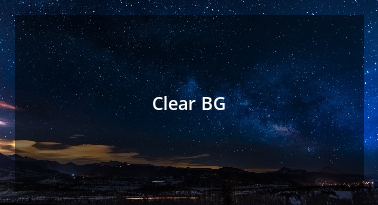
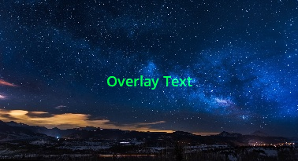
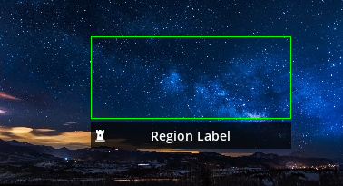
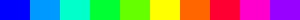

# k-vision
[](https://travis-ci.com/krinj/k-vision) [](https://codecov.io/gh/krinj/k-vision) 

The tools in this package help with rendering and visualizing image and text data. A lot of this package is based on the region class in the [**k-util** package](https://github.com/krinj/k-util). The functions in this package are geared towards working with actual image data.

* [Region Visualization](#region-visualization)
* [Text](#text)
* [Color Generator](#color-generator)

## Region Visualization

Suppose you have a list of one or more regions, and a target image, you can use these functions to create some output visualizations. This is useful if you want to highlight regions, mask regions, pixelate regions, or crop and insert regions.

##### Draw Regions

```python
image = visual.draw_regions(image, [r1, r2], color=(0, 255, 0), overlay=True)
```


##### Mask Regions

```python
image = visual.draw_region_mask(image, [r1, r2])
```


##### Pixelate Regions

```python
image = visual.pixelate_region(image, [r1, r2])
```


##### Region Extraction

Another notable feature of the visual tools is to be able to safely extract or implant image regions. It's often we need to crop something that is on the edge of an image. These safe extractions will handle those cases by padding the cropped image with black pixels. It can be used both with just numbers, or with a region.

```python
visual.safe_extract(image, -100, 200, -100, 200)
visual.safe_extract_with_region(image, region)
```


## Text

Draw text onto an OpenCV/Numpy format image. This uses a vector font which is then rasterized to the desired size, so we should get good looking text.

#### Plain Text

Draw a text at the given position onto the image.

```python
image = text.raw_text(image=image, text=display_text, x=0, y=0)
```



#### Text Size

Text size can be adjusted numerically. It will rasterize the font for that size and then render it onto the image.

```python
image = text.write_into_region(
    image=image, text=display_text, region=region, font_size=42)
```


#### Region with BG

Sometimes it is useful to render a BG behind the text for readability. If we define a region, the entire region will be considered the BG. The BG can also have variable opacity.

```python
image = text.write_into_region(
    image=image, text=display_text, region=region, bg_color=(0, 0, 0))
```


#### Left Aligned at Position

We can also set the alignment of the text.

```python
image = text.left_at_position(
    image=image, text=display_text, x=0, y=100, pad=15, bg_color=(0, 0, 0))
```



#### Centered at Position

```python
image = text.center_at_position(
    image=image, text=display_text, x=150, y=100, pad=15, bg_color=(0, 0, 0))
```



#### Region Anchor

If we define a region for the text to be rendered in, we can also anchor it to some place within that region.

```python
image = text.write_into_region(
    image=image, text=display_text, region=region, pad=15,
    h_align=text.ALIGN_LEFT, show_region_outline=True)
```



#### Top Left Anchored

The text can be written as anchored to any part of the parent image. In this case, we will anchor the text to the top left corner. Of course, you can change the `h_anchor` and `v_anchor` to render the text in different positions.

```python
image = text.write_anchored(
    image=image, text=display_text, h_anchor=text.ALIGN_LEFT, 
    v_anchor=text.ALIGN_TOP, pad=15, bg_color=(0, 0, 0))
```



#### Inline Icon

This package also embeds font icons from [FontAwesome](https://fontawesome.com/icons). You can replace the unicode here to render different icons.

```python
image = text.write_into_region(
    image=image, text=display_text, region=region, icon=u"\uf447",
    pad=12, h_align=text.ALIGN_LEFT, show_region_outline=True)
```



#### Clear BG

Render a region with clear opacity.

```python
image = text.write_into_region(
    image=image, text=display_text, region=region, bg_color=(0, 0, 0), bg_opacity=0.5)
```



#### Overlay Text

To render the text with a [linear dodge](https://en.wikipedia.org/wiki/Blend_modes#Dodge_and_burn) overlay effect.

```python
image = text.write_into_region(
    image=image, text=display_text, region=region, color=(0, 255, 0), overlay=True)
```



#### Region Label

If you already have a region being visualized, you can attach a text label to the top or bottom of the region like so.

```python
image = text.label_region(
    image=image, text=display_text, region=region, icon=u"\uf447", show_at_bottom=True)
```




## Color Generator

Usually with visualization, we need to generate **n** distinct colors to help with labeling unique objects. Here is a function to generate such a list of colors. Note that other parameters, such as the hue radius, saturation, and brightness are also configurable.

#### Method Signature

Normally you can just specify **n**, the number of unique colors needed. But if you need more control, you can also submit the additional parameters such as brightness, hue offset, etc.

```python
def generate_colors(n,
                    saturation: float = 1.0,
                    brightness: float = 1.0,
                    hue_offset: float = 0.0,
                    hue_range: float = 1.0,
                    as_numpy: bool = False):
    """ Generates a list of colors with the given parameters. """
    pass
```

#### Example Color Bar

Here is some sample code to generate a bar with 10 unique colors.

```python
width = 300
height = 20
image = numpy.zeros((height, width, 3))
n = 10
gap = width // n
colors = visual.generate_colors(n)
for i in range(n):
	x = i * gap
	cv2.rectangle(image, (x, 0), (x + gap, height), color=colors[i], thickness=-1)
```

